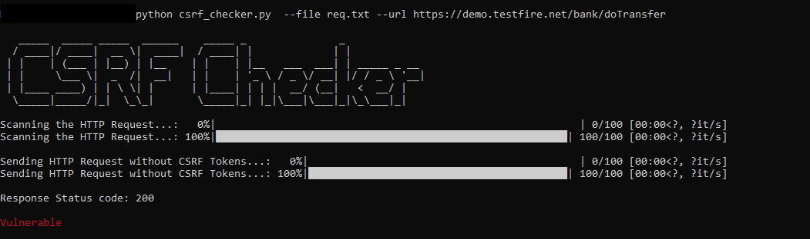

# CSRF-Checker
The tool checks for CSRF vulnerability in the HTTP Request.

# Installation 
Git clone the repo for linux or Download Zip file

`git clone https://github.com/Karthik-MP18/CSRF-Checker.git`

Run requirements.txt first to make sure all modules used in the script are installed

`pip install -r requirements.txt`

# Usage
python csrf_checker.py  --file (PATH TO HTTP REQUEST TXT FILE) --url (URL OF THE HTTP REQUEST)

